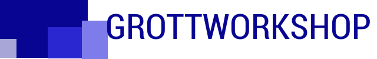

GWSViewModel
---

There are times when you do not need a full application architecture as the application is small in
nature or is not very complex. These cases may call for only maintaining the view state during an
orientation change.for example.

Thus, view model can help in persisting the state during orientation changes. Nice and small compact
library to be standalone and do one thing extremely well. At this time it's not event base driven to keep
it simple.

# Usage

See the sample application in this repo. Remember, that you can use this in combination with my GWSBindroid
as that library allows you to notify the UI when the model changes.

# Package Naming

What gives?  Most beginning android application developers end up naming different parts of patterns incorrectly
such as the layout xml file as a view or activities and fragments as views.  Obviously, they are not or
otherwise Google Engineers would also use the same terms.

View is either a single UI component couploed with a xml layout file and or full groups of UI components and
their xml layout file. Activities and Fragments are viewControllers as Google wanted a pattern of thin
views with UI component business logic in viewControllers as that is an easier pattern for beginning
java developers to learn.

Hence, the two subpackages of library of viewmodel and viewcontrollers.

# Resources
## Articles

## Developer Sites

[Google Android Developer Site](http://developer.android.com)

[Google Android Developer Tool Site](http://tools.android.com)

[Google Android Developer Blog](http://android-developers.blogspot.com/)

[StackOverflow Android Questions](http://stackoverflow.com/questions/tagged/android)

[Gradle](http://gradle.org)

[Reddit-androidev](http://reddit.com/r/androdev/)

[Amazon Android Dev Site](https://developer.amazon.com/public)

[JavaRanch Android Forum](http://www.coderanch.com/forums/f-93/Android)

# Project Contributors

[Fred Grott GWS](http://shareme.github.io/FredGrott)

# About Fred Grott/GWS

Fred Grott(GrottWorkShop) is a mobile developer specializing in android and focusing
on completing consulting contracts for porting iPhone applications to android and
MVPs for start-ups in the Greater ChicagoLand area. Part of Fred Grott(GWS) focus is
producing fast android application prototypes in an agile way. Ways to contact are
via email listed on the github profile page as I do not obfuscate my email when I
do github commits.

## Recruiter Warning

If you are a recruiter do not play the spam games of spamming my email or GoogleVoice number as
no recruiter has anything to sell me as those like me in that they are computer software
engineer polyglot have no need to play the broken HR hiring game as we plot our own unique course.
And if you are a start-up founder that does their own mobile dev recruiting instead of out-sourcing
it than you might know what I am looking for or seeking.

## What I Want?

If you are a startup in the Northwest Indiana or Chicago and are in-fact seeking a Senior Android Engineer
that would be able to create either an android application from scratch or port an iOS app to android that
is testable and maintainable and has a user interface that seduces the mobile device user than you are on-the-road
to knowing what I might want. Even better if you can match my work-remote paid weekly requirements.
And that conversation usually starts with a paid meal at my location.

## Fred Grott's Social Profiles

[Fred Grott AngelList](https://angel.co/fred-grott)

[GWS Behance](https://www.behance.net/gwsfredgrott)

[Fred Grott BitBucket](https://bitbucket.org/fredgrott)

[GWS Blog](http://grottworkshop.blogspot.com)

[Fred Grott BuiltInChicago](http://www.builtinchicago.org/member/fred-grott)

[Fred Grott DeviantArt](http://shareme.deviantart.com)

[Fred Grott Dribbble](https://dribbble.com/FredGrott)

[Fred Grott Facebook](http://www.facebook.com/fredgrott)

[Fred Grott FounderDating](http://members.founderdating.com/profile/6572)

[Fred Grott GeekList](https://geekli.st/fredgrott

[Fred Grott GeekList Git](https://git/geekli.st/u/fredgrott)

[Fred Grott GitHub](https://github.com/shareme)

[Fred Grott GitHub Gists](https://gist.github.com/shareme)

[Fred Grott GWS Website](http://shareme.github.io/FredGrott/)

[Fred Grott Google Stream](https://plus.google.com/u/0/+FredGrott/about)

[Fred Grott HackerNews](https://news.ycombinator.com/user?id=fredgrott)

[Fred Grott LinkedIn](http://www.linkedin.com/in/shareme/en)

[Fred Grott Medium](https://medium.com/@fredgrott)

[Fred Grott Pinterest](http://www.pinterest.com/fredgrott/)

[Fred Grott Quora](http://www.quora.com/Fred-Grott)

[Fred Grott Reddit](http://www.reddit.com./user/fredgrott/)

[Fred Grott SlideShare](http://www.slideshare.net/shareme)

[Fred Grott SpeakerDeck](https://speakerdeck.com/fredgrott)

[Fred Grott StackOverflow](http://stackoverflow.com/users/237740/fred-grott)

[Fred Grott Twitter](https://twitter.com/fredgrott)

[GWS UStream Channel](https://www.ustream.tv/manage-show/12940149)

[Fred Grott Vimeo](https://vimeo.com/user411149)

[Fred Grott YouTube](https://www.youtube.com/c/FredGrott?gvnc=1)

# License
Copyright (c) 2015 Fred Grott(GrottWorkShop)

Licensed under the Apache License, Version 2.0 (the "License"); you may not use this file except
in compliance with the License.You may obtain a copy of the License at

      http://www.apache.org/licenses/LICENSE-2.0

Unless required by applicable law or agreed to in writing, software distributed under the License
is distributed on an "AS IS" BASIS, WITHOUT WARRANTIES OR CONDITIONS OF ANY KIND, either express or implied.
See the License for the specific language governing permissions andlimitations under the License.