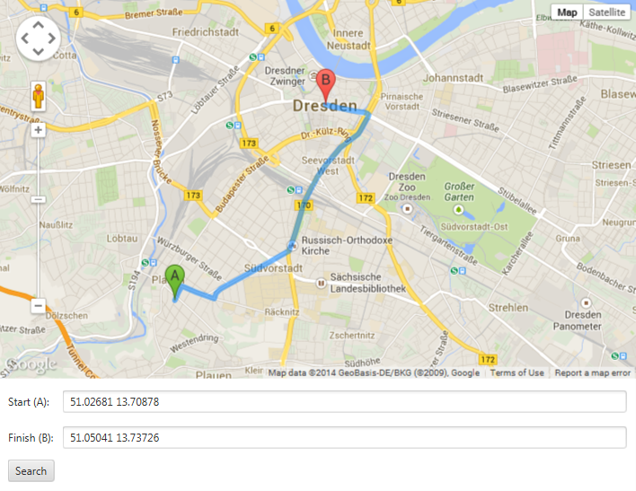
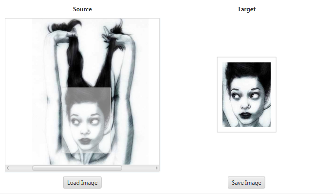

JFXControls
===========

##Show Case Controls (UI Patterns)

###Router (JFXMaps)

* navigation from origin to destination
* string properties 4 source and target position
* integration of Google's Maps Javascript API
* customization of WebView and aggregation of the result inside a custom control to be imported into the SceneBuilder
* batch property changes within a delay of 3 seconds using executor services on tasks

####Refactorings
* inherit directly from WebView
* move AL into Skin

###ImageCropper

* intent: load, crop and save images via moving a cropper rectangle
* properties: 
  * source + target image
  * cropper height + width
  * cropper fill + stroke color
* custom control whose skin aggregates standard components as well as further custom components (source and target image view)
  * source image view
  * target image view

####Refactorings
* Import 2 SceneBuilder: Enable visualization of subcontrols after the import
* replace StackPane inside ScrollPane + remove ImageCropperScrollPane multiple children bounds bindings (exchenge skins)
* JPG rgb correction

###MasterDetailsView

* Intent: master (1:n) detail relation
* common UI Pattern
  * characterization: a little architectural but mostly a perceptual pattern related to usability aspects
  * but also established on model layer <=> think of SQL tables
* User Experience | Usability Aspects
  * "efficient user experience by allowing the user to stay in the same screen while navigating between items"
  * "see more information for a master list"
  * >>> blub :D
* Use Cases: 
  * thumbnail (1) : larger image, download url (n)
  * menu (1) : files, directories, paths (n)
    * i.e. file browser, audio player, contact browser
  * customer (1) : username, address, contracts (n)
  * Tracking the masters selection via properties (<code>IObservableValue</code>)
* features
  * vertical | horizontal mode
  * change relative ratio using a SplitPane
  * master (1:n) detail relation
  * master part
    * typically a list or a tree
    * master part gets abstract 2 enable the user of this class to implement a custom viewer
    * JFace: Master part must be created and at least one details page should be registered
  * details part
    * set of properties driven by the selection in the master > REBIND on selection change
    * details part tries to load a page registered to handle the selected object(s)
    * page shows the details of the selected object(s) and allows users to edit them
      * detail properties gets binded bidirectional to enable editing of detail with immediate reflection 2 the master part
    * JFace: "Details pages can be registered statically using 'registerPage' or dynamically through the use of 'IDetailsPageProvider' in case where different pages need to be shown for objects of the same type depending on their state."

####Existing Approaches

#####JFace Forms API (MasterDetailsBlock) <a href="http://help.eclipse.org/kepler/index.jsp?topic=%2Forg.eclipse.platform.doc.isv%2Fguide%2Fforms_master_details.htm">[cite]</a>
Master/Details is a pattern used throughout the UI world. It consists of a list or a tree ('master') and a set of properties ('details') driven by the selection in the master. Eclipse Forms provide the implementation of the pattern as a useful building block with the following properties:

* While details part is created, master part factory method is abstract and must be implemented by the subclass
* Master and details parts are children of the sash form and the ratio of the form space allocated for each can be changed by moving the sash
* Through the nature of the sash form, master and details parts can be organized horizontally or vertically in the form

The idea of master/details block is to create a tree or a table section that fires the selection notification via the managed form. If the details part can handle the selected object, it should switch to the page for it and display properties. When building on top of the provided master/details block, subclasses should:

* Create the master part (the one that drives the details)
* Contribute actions to the form tool bar (consumes upper-right portion of the form in the title area)
* Register details pages, one for each distinct input that can arrive from the master part

#####JavaFX
* <a href="http://stackoverflow.com/questions/11633472/master-details-with-treeview">StackOverFlow: Bidirectional Bindings (master <=> detail) in a TreeView</a>
* <a href="http://tiwulfx.panemu.com/download/">TiwulFX has already such a thing implemented</a>

###TreeTableView
[TODO: Impl]

###Further Ideas
* Validator and Decorators (see <a href="http://www.vogella.com/tutorials/EclipseDataBinding/article.html#jfacedb_masterdetail">JFace</a>, <a href="http://www.jidesoft.com/blog/2013/06/06/jidefx-beta-release/">JideFX</a>)
* UI Patterns for WebApps: Search/Results, Spreadsheet, Wizard, Interactive Model (see <a href="http://designingwebinterfaces.com/designing-web-interfaces-12-screen-patterns">Principles and Patterns for Rich Interaction</a>)
* Horizontale Layouts (Java 8)
* Keyboard Navigation (check also <a href="https://wiki.openjdk.java.net/display/OpenJFX/User+Experience+Specifications">User Experience Specifications</a>)
* Tooltipp sytling of a control via CSS

##Common Tasks

###System Prerequisites
* Java 8 (EA)
* Gradle 1.10
* Git
* some IDE - I'm using eclipse kepler..
* further tools of your like

Pretty soon I'm also going 2 introduce ScalaFX.

###Behind a Proxy?
If you're behind a proxy server: There is an <code>application.conf</code> provided under the following path:

<pre>
JFXControls/src/main/resources/org/devel/jfxcontrols/conf/application.conf
</pre>

Please customize this depending on your needs.

###Eclipsify the Project

####Approach 1

<pre>
.. $ gradle eclipse
</pre>

No you're ready 4 import!

####Approach 2
Install eclipse gradle support!

###Testing
And once again pretty simple:

<pre>
.. $ gradle test
</pre>

By the way, this project uses TestFX 3.0.0 to run automated UI tests on well suited controls ;)

###Build a native client
Just run the following commands havin' a gradle distribution on your env path.

<pre>
.. $ gradle install
.. $ gradle assemble
</pre>

After running the <code>SUCCESSFULL BUILD</code> you'll find the following bundles inside the freshly created <code>build</code> directory:

* executable JAR
* native client 4 windows and linux os
* all required classpath libs to run the sample application
