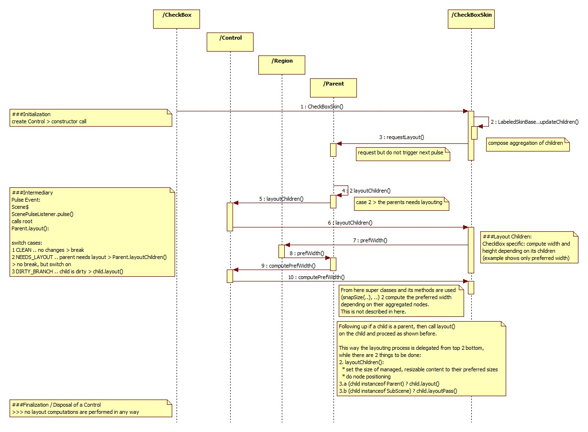

#Layout Computation Lifecycle (SkinBase)
<b>Contents:</b>
* show basic principles of layout computation with focus on SkinBase and its mirrored Control
* explore its three relevant phases of layout computation: 
  * initialization
  * intermediary layout changes computed on a pulse
  * finalization process

##Definition of Pulse
<b>Definition:</b> "A pulse is an event that indicates to the JavaFX scene graph that it is time to synchronize the state of the elements on the scene graph with Prism."

###When is it fired?
* a pulse is throttled every 60 fps (frame rate not fixed; can be altered by developers)
* fired whenever animations are running on the scene graph

###Definition of DIRTYness
There are 3 states a <code>Parent</code> can have concerning the aspect of DIRTYness:
  1. CLEAN .. no layout changes > break
  2. NEEDS_LAYOUT .. parent needs layout > Parent.layoutChildren()
    * By default it will only set the size of managed, resizable content to their preferred sizes and does not do any node positioning.
    * Custom Controls implement this method to compute min/preferred/max widths/heights and position its child nodes
      * ATTENTION: Do not break encapsulation, i.e. delegate as much as possible to sub controls.
  3. DIRTY_BRANCH .. parent is dirty branch > children are dirty > forall children: child.layout()
    * this parent is a dirty branch, i.e. its children are dirty and have to get layouted

##Layout Mechanism
* Scene graph layed out once per pulse, before rendering
* requests all coalesced for next layout pass
* layout executes top-down from parent to its children (dirty branches only)

###Intialization
* covers the construction of the control and its corresponding skin
* <b>BEST PRACTICE:</b> compose aggregation of the children of a labeled control inside <code>LabeledSkinBase.updatechildren()</code>
* <b>BEST PRACTICE:</b> call <code>Parent.requestLayout()</code> to mark a parent to request layouting with the next pulse, when constructing a control inside the constructor of the corresponding skin

###Intermediary (Pulse)
* each scene has a specific ScenePulseListener, whose operation <code>pulse()</code> is called, when the next pulse event occurs
* on every pulse the root Parent gets layouted (<code>Parent.layout()</code>), if it is marked as dirty (see the 3 states of DIRTYness discovered earlier)
* inside this method switch on the <code>Parent</code>s state, whereas mainly 3 things may happen:
  * case: <code>CLEAN</code>: nothing will happen
  * case: <code>NEEDS_LAYOUT</code>: but currently performing layout: nothing will happen
  * case: <code>NEEDS\_LAYOUT</code> && <code>DIRTY_BRANCH</code>:
    1. call Parent.layoutChildren()
      * set the size of managed, resizable content to their preferred sizes
      * do node positioning
    2.a (child instanceof Parent) ? child.layout()
      * proceed layouting from top to bottom
    2.b (child instanceof SubScene) ? child.layoutPass()
      * pass layouting request to subscene

###Finalization / Closing the Stage
* no layout computations are performed in any way

##FAQ

###How 2 request Layouting for the next Pulse?
* central method 4 request layouting (by children or the parent itself): <code>Parent.requestLayout()</code>
  * <b>BEST PRACTICE:</b> nodes call <code>requestLayout()</code> when preferred size changes
  
###When does a Parent get marked as dirty in a common case as for a CheckBox?
* when ..
  * parent is f.e. resized
  * children 

###When are the <code>SkinBase.compute..()</code> methods are called?
* this depends on the implementation of <code>Parent.layoutChildren()</code> of the specific control
* the <code>SkinBase.compute..()</code> methods are called, if ..
  * this is the initial run (even if <code>USE\_COMPUTED\_SIZE</code> is set)
  * every time a min/pref/max width/height is requested 4 the control, not using <code>USE\_COMPUTED\_SIZE</code> during the layout process

###How does the parent know, that its children are DIRTY?
* children request the layouting of the parent via <code>Parent.requestLayout()</code> commonly if some user interaction occurs
* Parent has a property <code>Parent.needsLayoutProperty()</code>, which gets called by ..
  * concrete skins of the <b><code>Parent</code></b> after the initialization of the corresponding skin (via constructor) (f.e. Accordeon)
  * the <b>children</b> (not necessarily by <code>Control</code> but sufficient 4 <code>Node</code>) of the Parent, which cause layout changes (f.e. followed up a user interaction; f.e. see <code>ShapeChangeListener</code>)
* if its corresponding protected setter <code>Parent.setLeedsLayout(..)</code> is called the following happens:
  * the layout of the parent gets marked as dirty (<code>Parent.markDirtyLayout(boolean)</code>) 
    * in here the next pulse is requested (not triggered!!!), if the layout should be marked as dirty or the corresponding method is called on a layout root, and the parent is also the scene root
    * if the parent isn't the scene root but the layout root, the parent gets marked as <code>DIRTY_BRANCH</code>
    * if the parent is wether a layout root or it should also not be marked as dirty, the parent of the parent is requested to be layouted (i.e. <code>Parent.requestLayout()</code>)
    * if this scene has subscenes, then their layout is set to dirty as well
  * if the parent has children that are also parents, the parent gets marked as DIRTY_BRANCH

###How 2 do node positioning during Layouting process?

<pre>
public class CheckBoxSkin extends LabeledSkinBase<CheckBox, ButtonBehavior<CheckBox>> {

    [...]

    @Override protected void layoutChildren(final double x, final double y,
            final double w, final double h) {
        final CheckBox checkBox = getSkinnable(); 
        final double boxWidth = snapSize(box.prefWidth(-1));
        final double boxHeight = snapSize(box.prefHeight(-1));
        final double computeWidth = Math.max(checkBox.prefWidth(-1), checkBox.minWidth(-1));
        final double labelWidth = Math.min( computeWidth - boxWidth, w - snapSize(boxWidth));
        final double labelHeight = Math.min(checkBox.prefHeight(labelWidth), h);
        final double maxHeight = Math.max(boxHeight, labelHeight);
        final double xOffset = Utils.computeXOffset(w, labelWidth + boxWidth, checkBox.getAlignment().getHpos()) + x;
        final double yOffset = Utils.computeYOffset(h, maxHeight, checkBox.getAlignment().getVpos()) + x;

        layoutLabelInArea(xOffset + boxWidth, yOffset, labelWidth, maxHeight, checkBox.getAlignment());
        box.resize(boxWidth, boxHeight);
        positionInArea(box, xOffset, yOffset, boxWidth, maxHeight, 0, checkBox.getAlignment().getHpos(), checkBox.getAlignment().getVpos());
    }
}
</pre>

###What about Layout Computation Caching?
* Parent offers a cache for computing min/pref/max width/height
* How does this work?

###Further
* LabeledSkinBase.updateChildren() is called 4 every LabebeldSkinBase (i.e. the skin of a control, which has a label)

